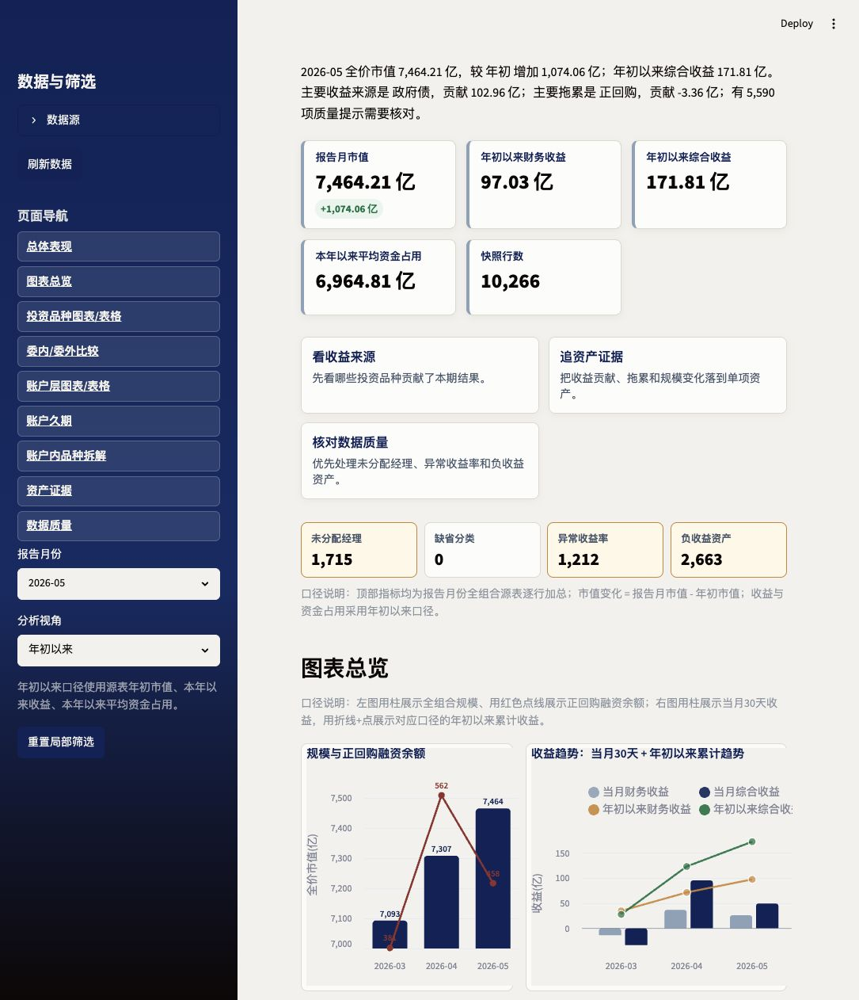
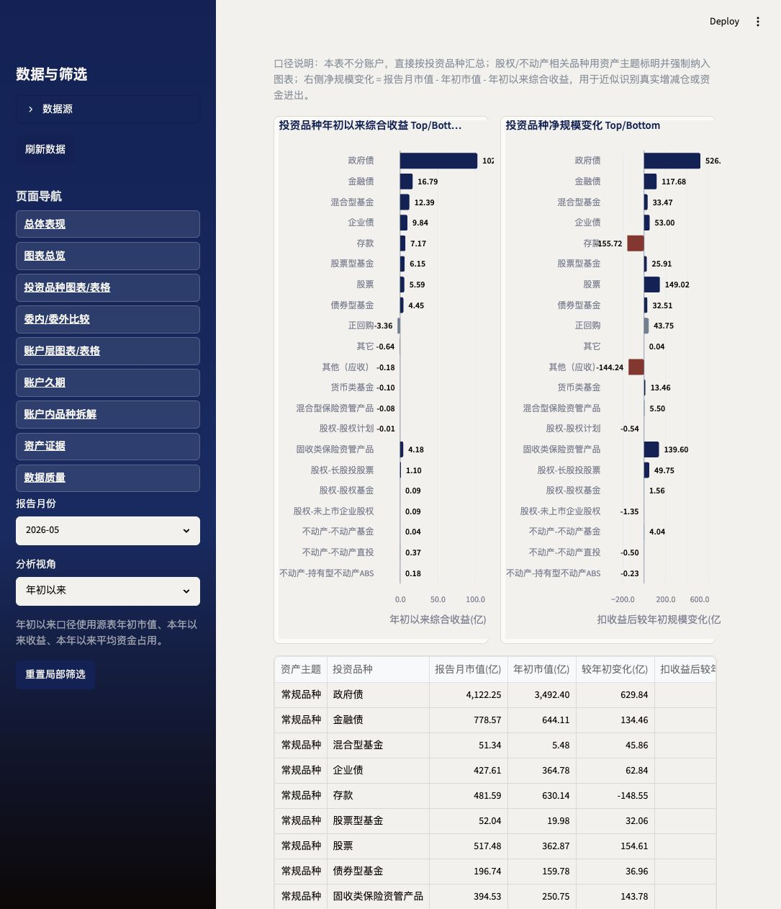
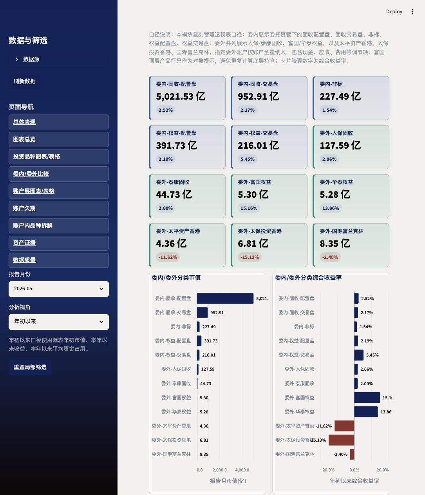
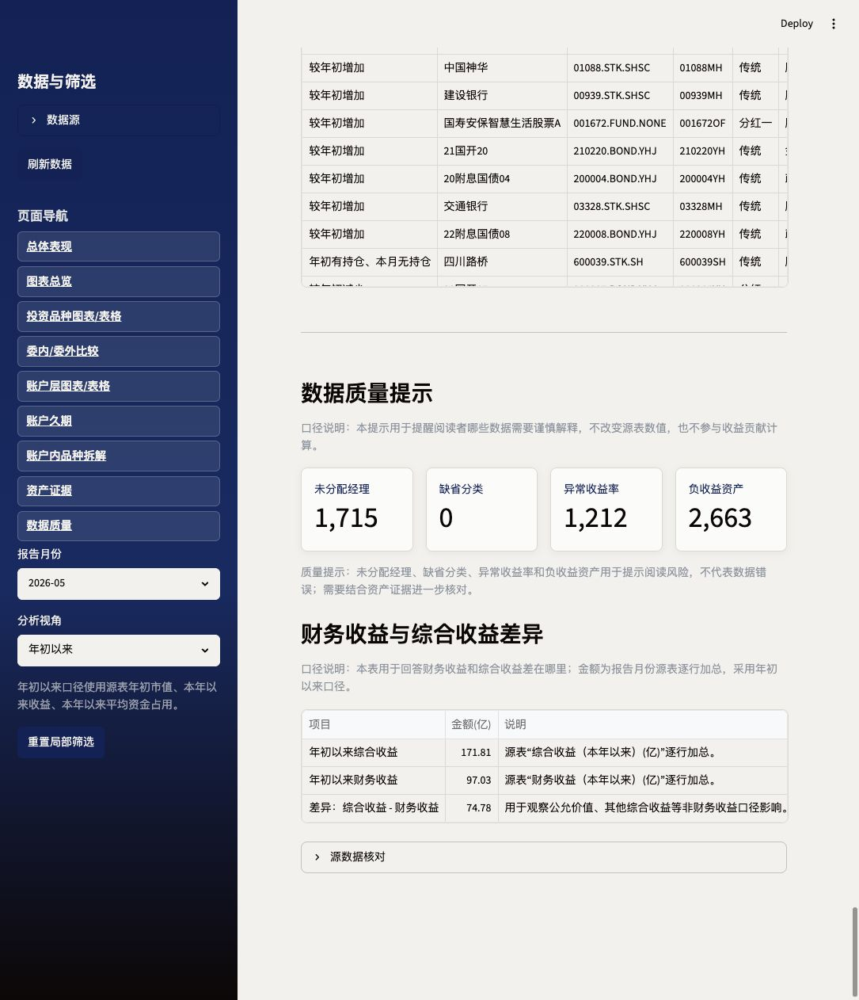

# 组合管理账户复盘

一个面向组合管理月度复盘的 Streamlit 数据看板。项目把组合宽表、账户维度、投资品种、委内/委外盘子、久期和资产明细证据串在同一个工作流里，用来回答三个核心问题：

- 组合规模和收益本月/年初以来发生了什么变化？
- 哪些账户、品种、经理和委受托关系贡献或拖累了结果？
- 汇总结果能否追溯到单项资产，并暴露数据质量问题？

这个仓库也可以作为个人页面或作品集案例使用：它展示了从原始 Excel 宽表到交互式分析产品的完整实现，包括数据口径沉淀、指标解释、图表交互、异常提示和资产级别 drill-down。

## 页面预览

### 总体表现与趋势



### 投资品种总览



### 委内/委外比较



### 账户久期



## 核心功能

- **总体复盘**：汇总报告月市值、年初以来收益、平均资金占用、快照行数和数据质量提示。
- **趋势图表**：展示全价市值、正回购融资余额、当月收益与年初以来累计收益走势。
- **投资品种分析**：按投资品种比较收益贡献和扣收益后的规模变化，并强制纳入股权/不动产主题品种，避免低频资产被 Top/Bottom 截断。
- **委内/委外比较**：并列展示委内配置盘、交易盘、非标，以及人保、泰康、富国、华泰、太平资产香港、太保投资香港、国寿富兰克林等委外账户。
- **账户与经理拆解**：支持账户、投资品种和投资经理局部筛选，帮助从组合结果定位到具体责任维度。
- **资产证据**：把收益贡献、收益拖累、规模增减和年初持仓变化追溯到单项资产。
- **数据质量检查**：集中提示未分配经理、异常收益率、负收益资产、缺失字段等需要人工核对的问题。

## 数据与口径

- 月度快照文件放在 `data/monthly_snapshots/`。
- 数据读取与字段标准化在 `portfolio_data.py`。
- 账户、品种、经理和资产证据汇总在 `account_review.py`。
- 委内/委外、配置盘/交易盘分类规则在 `strategy_books.py`。
- rat race 模块的映射说明和 20260630 控制数见 `docs/strategy_book_mapping.md`。
- 必需字段、可选字段和标准列名集中维护在 `config.py`。

## 本地运行

```bash
python -m venv .venv
source .venv/bin/activate
pip install -r requirements.txt
PORTFOLIO_APP_PASSWORD=your-password streamlit run app.py
```

然后打开 `http://localhost:8501`，输入 `PORTFOLIO_APP_PASSWORD` 配置的访问密码。

## 验证

```bash
python -m compileall app.py portfolio_data.py account_review.py strategy_books.py config.py
python -m unittest discover
```

## 项目结构

```text
.
├── app.py                         # Streamlit 页面、主题和图表编排
├── portfolio_data.py              # 月度快照发现、读取和标准化
├── account_review.py              # 账户/品种/经理汇总与资产证据
├── strategy_books.py              # 委内/委外与配置盘/交易盘分类
├── config.py                      # 字段映射和全局配置
├── data/monthly_snapshots/        # 月度组合宽表
├── docs/strategy_book_mapping.md  # rat race 口径文档
└── tests/                         # 分类规则与控制数测试
```
